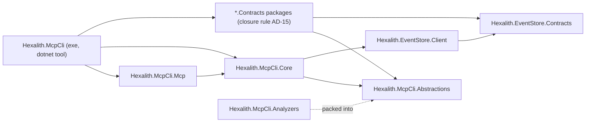
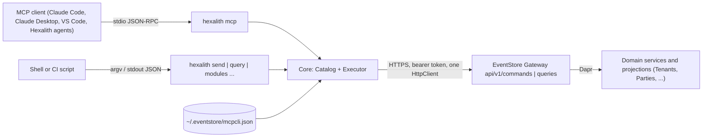
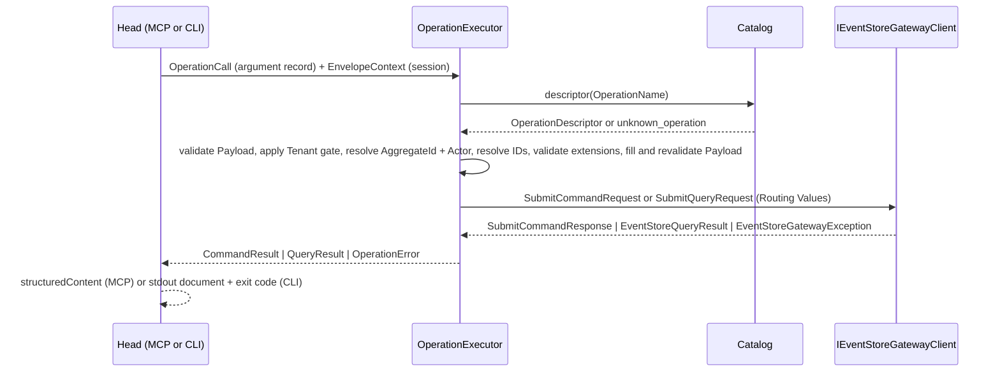

# Architecture Spine — Hexalith.McpCli

## Design Paradigm

**Hexagonal.** One core that knows Contracts types, the Catalog, validation, the Envelope, and the gateway port. Two adapters (the MCP Server head and the CLI head) that translate their protocol into the core's call model and back, and nothing else. The gateway client, the settings sources, and id generation are ports.

| Hexagon layer | Project | Namespace root |
| --- | --- | --- |
| Contract the Modules see | `Hexalith.McpCli.Abstractions` (the Decoration Package) | `Hexalith.McpCli.Abstractions` |
| Core (domain of this tool) | `Hexalith.McpCli.Core` | `Hexalith.McpCli.Core.Catalog`, `.Schema`, `.Execution`, `.Settings`, `.Serialization` |
| Adapter, MCP | `Hexalith.McpCli.Mcp` | `Hexalith.McpCli.Mcp` |
| Adapter, CLI + composition root | `Hexalith.McpCli` (the tool executable) | `Hexalith.McpCli.Cli`, `Hexalith.McpCli.Hosting` |
| Build-time discovery | MSBuild target in `Hexalith.McpCli` | generated `ModuleAssemblyManifest` |
| Author-time guard | `Hexalith.McpCli.Analyzers` | `Hexalith.McpCli.Analyzers` |

## Invariants & Rules

### AD-1 — Heads are translators; the core decides

- **Binds:** all
- **Prevents:** a head validating a Payload, filling an Envelope, enforcing Read-only Mode, resolving settings, or reflecting over a Contracts type on its own, so that the two Heads disagree (SM-4).
- **Rule:** `Hexalith.McpCli.Core` references no MCP, System.CommandLine, or ASP.NET package. It owns shared settings values, Catalog, validation, execution, and typed result/error records. A head binds its assigned input to Core argument records (AD-5), calls `ICatalog` or `IOperationExecutor`, and owns transport, tool advertisement, exit-code mapping, rendering, and protocol carriage. A head reads `ResolvedSettings` from DI and never calls the resolver, environment, or Profile store.

### AD-2 — Dependency direction

- **Binds:** all projects
- **Prevents:** Contracts references leaking into a library package; a second composition root; heads sharing an assembly with the core.
- **Rule:** dependencies flow only as drawn. `Hexalith.McpCli` (exe) is the only project that references `*.Contracts` packages. `Hexalith.McpCli.Abstractions` has zero package references.



### AD-3 — The Catalog is the only view of Contracts types

- **Binds:** Core, both heads, FR-5 to FR-8, FR-19
- **Prevents:** the executor or a head re-reflecting a type and disagreeing with what `describe_operation` showed; two Catalogs in one test; `config` dying on an empty Catalog.
- **Rule:** `CatalogBuilder.Build(IReadOnlyList<Assembly>)` is the only entry point; the composition root passes the generated manifest (AD-4), unit tests pass `Sample.Contracts`. It freezes an immutable model: `ModuleDescriptor(Name, Description, IdentifierKind, FixedTenant, WireTypeConvention, ModulePayloadOptions, Operations)` and `OperationDescriptor(Name, Kind, Description, Example, Schema, Routing, AggregateIdAccessor, AggregateIdConstant, AggregateIdRequired, EnvelopeFilledProperties, ContractType)` plus `IReadOnlyList<CatalogDiagnostic>`. The marker's `SerializerOptionsProvider` member is a `Type` from the marked Contracts assembly; that type must expose `public static JsonSerializerOptions Options { get; }`. The Catalog validates and reads it exactly once, then caches the AD-6 result as `ModulePayloadOptions`; an invalid provider excludes the Module with `invalid_serializer_options_provider`. `System.Reflection`, the Decoration Attributes, and the contract interfaces are used only inside `Hexalith.McpCli.Core.Catalog`. The Catalog is built lazily by the first verb that needs it; `config`, `--version`, and `mcp --transport http` never touch it; an empty Catalog is a startup failure (exit 2, `catalog_empty`) only for discovery verbs, `send`, `query`, and `mcp`. A single immutable Core execution-availability value derives from `ResolvedSettings`: write Operations in Read-only Mode have `submittable: false, reason: read_only`; otherwise a missing Gateway URL gives `submittable: false, reason: configuration_invalid`. `ICatalog.Describe` and executor preflight consume that same value. `ICatalog.ListOperations` returns the Core `unknown_module` error for a non-empty requested Module absent from the Catalog, with up to three nearest declared canonical Module Names ordered by case-insensitive edit distance and ordinal tie-break; missing or empty module arguments fail Head input binding before Catalog dispatch: MCP returns a JSON-RPC invalid-parameters error before tool invocation, and CLI exits 2 with the addendum §G `invalid_arguments` document (`argument: module`). Discovery and MCP startup succeed without a URL; the descriptor carries no session state.

### AD-4 — Assembly manifest is generated, not listed

- **Binds:** `Hexalith.McpCli`, its build targets, FR-5, FR-20
- **Prevents:** a hand-maintained assembly list, a folder scan, or a marker-only Contracts assembly (Folders today) missing from `list_modules`.
- **Rule:** each production Contracts `PackageReference` in the tool project carries `HexalithContracts="true"`. An MSBuild target after `ResolveReferences` matches those package identities to `ReferenceCopyLocalPaths` by `NuGetPackageId`, fails if a flagged package contributes zero or multiple Contracts assemblies, and generates `ModuleAssemblyManifest.g.cs` with the assembly names ordinally sorted. The composition root loads exactly that manifest with `Assembly.Load(new AssemblyName(...))`; no folder scan or source-maintained list exists. A build test asserts the generated package/assembly pairs equal the flagged references. It includes a flagged unmarked assembly, which is invisible with no diagnostic, and a flagged marked empty assembly, which appears in `list_modules` with zero Operations and `empty_module`. The tool ships untrimmed (AD-17), so each manifest assembly remains in the package.

### AD-5 — One call model, one document set, equal across heads

- **Binds:** Core, both heads, FR-9, FR-11, FR-12, FR-14, SM-4
- **Prevents:** two result dialects; a CLI error shape that differs from the MCP one; a document that cannot be `structuredContent`.
- **Rule:** Core owns the argument records `ListOperationsArguments(Module, Kind?)`, `DescribeOperationArguments(Operation)`, `SendCommandArguments(Operation, Payload, Tenant?, AggregateId?, CorrelationId?, IdempotencyKey?, Extensions?)`, and `RunQueryArguments(Operation, Payload, Tenant?, AggregateId?, EntityId?, PageSize?, Offset?, Cursor?)`. Its public success/error records implement PRD addendum §G exactly: required members always appear, optional members are omitted when absent, arrays are empty rather than null, and all §G member types, constraints, and error variants are enforced. In particular, `list_modules` contains only `modules`; `describe_operation` includes `envelope`, `lintFindings`, and `submittable`; a successful Command includes `operation`, `messageId`, `correlationId`, `tenant`, `aggregateId`, and `status: accepted`, echoing `idempotencyKey` only when caller-supplied and including `result` only when the Gateway returns a payload; a successful Query includes `operation`, `tenant`, and `document` even when the document is JSON null, and `paging` only when returned, with required `pageSize` and independently optional other members. The exhaustive §G error variants include `unknown_module(Code, Module, Suggestions)` for a non-empty `list_operations` lookup miss and CLI-bound `invalid_arguments(Code, Argument, Message)` before Core dispatch; they preserve Gateway status and optional metadata without synthesis. `Payload` is accepted as text and parsed in Core with the Operation's AD-6 Payload options; non-JSON text is one violation at `/`. Both heads emit the same Core-owned JSON object with `McpCliJson.Result`; failures emit only `{ "error": <OperationError> }`. MCP input schemas derive from the argument records. Only the MCP adapter binds per-call `Tenant`; the CLI leaves it null and carries global `--tenant` through `ResolvedSettings` and `EnvelopeContext`. A surface-map test covers addendum §E; contract fixtures cover every §G success and error shape. Equality compares deterministic documents with `JsonElement.DeepEquals` after canonical serialization; AD-16 defines the live-test boundary.

### AD-6 — Serialization policy is owned by Core

- **Binds:** Core, both heads, FR-5, FR-7, FR-15, FR-16
- **Prevents:** the two heads choosing different Payload casing or converters; a Module converter changing Envelope or result serialization; result documents differing across heads.
- **Rule:** `McpCliJson.Payload` is the canonical Payload baseline: `PropertyNamingPolicy = null` and case-sensitive CLR property names (an explicit McpCli wire choice, verified against the current Tenants validator rather than asserted as a universal EventStore convention), `JsonStringEnumConverter`, nulls omitted, `UnmappedMemberHandling = Disallow`. At Catalog build, `McpCliJson.ForModule(providerOptions?)` creates and makes read-only one cached options instance per Module: copies the provider's converters in declared order, then canonical converters, while fixing all non-converter settings to the canonical baseline. Schema derivation, Payload parsing and validation, identifier-type probing, the aggregate-identifier accessor, and the Envelope `Payload` element use that Module instance. `McpCliJson.Result` is `JsonSerializerDefaults.Web`, camelCase, indented, with `JsonStringEnumConverter(CamelCase)`; it alone serializes head documents and MCP input/output schemas. Envelope fields outside `Payload` always use the gateway client's tool-owned policy; Module options never reach them.

### AD-7 — Schema derivation and validation

- **Binds:** Core, FR-4, FR-7, FR-15, FR-16
- **Prevents:** two schema generators producing different `describe_operation` output; a validator that stops at the first violation.
- **Rule:** the Schema is `JsonSchemaExporter.GetJsonSchemaAsNode(module.ModulePayloadOptions, type)` with one `TransformSchemaNode` in `Hexalith.McpCli.Core.Schema` that adds `description` from `[Description]`, sets `readOnly: true` and removes from `required` each envelope-filled property (AD-9), types identifiers per AD-8, removes get-only members that have neither a setter nor a constructor parameter (such as `ICommandContract.AggregateId`), and sets `additionalProperties: false`. `EnvelopeFilledProperties` is exactly the set named by `tenantProperty`, `correlationProperty`, `idempotencyKeyProperty`, and `actorProperty`; there is no name-based inference, so a `TenantId` not named by `tenantProperty` is ordinary Payload. Validation is `JsonSchema.Net` with `OutputFormat.List`; each violation reports `InstanceLocation` (a JSON Pointer) as its path. The Schema is derived once per Operation at Catalog build and stored on the descriptor. `describe --lint` recursively inspects serialized members inside nested objects and collections; each property-level finding carries its escaped RFC 6901 pointer in Module-serialized casing and stays out of Catalog diagnostics.

### AD-8 — Identifiers are marked, never guessed

- **Binds:** Abstractions, Core, FR-7, FR-15, FR-16. Amends PRD FR-7 and §3 (see PRD Amendments).
- **Prevents:** a non-ULID identifier such as the Tenants tenant id `system` failing its own Schema; the sample fixture and real Modules enforcing different kinds for the same value.
- **Rule:** the Module marker declares `IdentifierKind` (`Ulid` or `String`). A property carrying `[HexalithIdentifier]`, or named by `aggregateIdProperty`, gets Schema `{ type: string }` plus the ULID `pattern` when the Module's kind is `Ulid`; its CLR type must serialize as a JSON string under the Module Payload options (a converter-backed value object qualifies; otherwise `invalid_identifier_type` excludes the Operation). A property whose CLR type is `Ulid` gets the pattern regardless. An unmarked identifier-like property retains its serializer-derived Schema and produces only the `unmarked_identifier_like_property` lint finding; no identifier kind is inferred from its name. The executor validates the explicit `aggregateId` argument and the accessor value (AD-19) with the Module kind—`Ulid.TryParse(value, provider: null, out _)` for `Ulid`, non-empty for `String`—and then the Gateway pattern from AD-9. Tenant is never ULID-validated. Generated message identifiers and caller-supplied idempotency keys and correlation identifiers are always ULIDs; the tool never generates an idempotency key.

### AD-9 — The executor fills the Envelope [ADOPTED]

- **Binds:** Core, FR-15 to FR-17, FR-19
- **Prevents:** a head or a caller supplying a message identifier; a silently overwritten disagreement; retries anywhere.
- **Rule:** `IOperationExecutor.ExecuteAsync(OperationCall, EnvelopeContext, CancellationToken)` runs, in order: resolve the descriptor (else `unknown_operation` with up to three `Suggestions`); apply the shared execution-availability preflight from AD-3 (`read_only` before missing-URL `configuration_invalid`); parse and validate the Payload with the Module options (AD-6, AD-7, all violations); resolve Tenant; resolve the aggregate identifier (AD-19); resolve Actor; validate disagreements, Gateway patterns, and Command extensions; rebuild and revalidate the Payload; build one Gateway request; call `IEventStoreGatewayClient` exactly once; and map the response or `EventStoreGatewayException` to AD-5 records. Tenant precedence is: the Module's `FixedTenant`; otherwise the per-call MCP tenant when the session Tenant is absent or `EnvelopeContext.AllowTenantOverride` is true; otherwise the session Tenant. A differing per-call tenant is `validation_failed` at `/tenant` when `FixedTenant` applies or a session Tenant exists without the override gate; a missing Tenant is always `validation_failed`. An Operation naming `actorProperty` requires `EnvelopeContext.Actor`; Actor is never a per-call argument. Tenant, Actor, and aggregate disagreements use ordinal equality. Payload values under `tenantProperty` or `actorProperty` that differ from the resolved values, and an explicit aggregate identifier that differs from an accessor value, are `validation_failed` at the corresponding pointer. Before submission, Tenant must match the Gateway's lowercase alphanumeric-and-hyphen pattern at most 64 characters long; aggregate and entity identifiers must match its alphanumeric, dot, hyphen, and underscore pattern at most 256 characters long with no colon. Violations use `/tenant`, `/aggregateId`, and `/entityId`. For Commands, the executor generates `MessageId`, resolves `CorrelationId = Arguments.CorrelationId ?? MessageId`, accepts only a caller-supplied `IdempotencyKey`, validates the present identifiers as ULIDs, and passes the key only when supplied. Extension validation uses `AllowedExtensions` with ordinal-ignore-case membership, permits at most 32 entries, limits keys to 100 characters and values to 1,000 characters, limits their combined UTF-8 size to 4,096 bytes, and applies the pinned sanitizer's key grammar, control-character, and injection checks. These fixed limits are the intersection of the request validator and the default Gateway sanitizer; a deployment configured more strictly can still return `gateway_error`; violations use `/extensions` or `/extensions/<escaped-key>`. The executor overwrites `tenantProperty`, `correlationProperty`, and `actorProperty` with resolved values when declared. It fills `idempotencyKeyProperty` only when a caller supplied a key; if that property is non-nullable and no key was supplied, execution returns `validation_failed` at `/idempotencyKey`. Queries accept neither correlation identifier nor extensions and put neither into `SubmitQueryRequest`; they overwrite only envelope-filled properties for which the executor has a resolved value. The rebuilt Payload is validated again against the stored Schema before request construction; any violation returns `validation_failed` and the gateway client sees zero calls. At Catalog build the same Gateway rules validate every Routing Value, `FixedTenant`, and Query `aggregateId` constant, with `invalid_routing_value` excluding the Operation. The Envelope carries Routing Values, never the Operation Name. Any exception escaping the pipeline becomes `internal_error`.

### AD-10 — Transport seam

- **Binds:** Core, `Hexalith.McpCli.Hosting`, the HTTP release
- **Prevents:** the HTTP release touching Core; tokens or headers reaching the executor; the same handler registered twice.
- **Rule:** `EnvelopeContext` carries session values only: `Tenant`, `Actor`, `AllowTenantOverride`, and the immutable `AllowedExtensions` set from `ResolvedSettings` in v1; the HTTP release replaces Actor from the forwarded user header. Per-call values live in the argument records; the executor alone applies the gates and merges them (AD-9). `AddMcpCliCore(IServiceCollection, ResolvedSettings, Action<IHttpClientBuilder> configureGateway)` registers `AddEventStoreGatewayClient` exactly once with the resolved URL when present and leaves catalog-only startup available when absent and hands the builder to `configureGateway`; only `Hexalith.McpCli.Hosting` adds the auth `DelegatingHandler` inside that callback: v1 `StaticBearerTokenHandler`, next release a forwarding handler in the `Hexalith.Parties.Mcp` pattern. `ResolvedSettings.Token` is never read in Core; `Core.Tests` asserts that `AddMcpCliCore` with a no-op callback registers no `DelegatingHandler`.

### AD-11 — One composition root

- **Binds:** `Hexalith.McpCli`, `Hexalith.McpCli.Mcp`, Core, FR-13, FR-17, FR-18, FR-19
- **Prevents:** the admin-CLI no-container style in one head and a Host in the other; two gateway client registrations; a second settings resolver.
- **Rule:** every verb, including `mcp`, runs inside one `Host.CreateApplicationBuilder` container built by `Hexalith.McpCli.Hosting`. One `ProfileStore` owns `~/.eventstore/mcpcli.json`; `SettingsResolver` reads it exactly once per process, after System.CommandLine has parsed the invoked verb's global options and before the container is built, and registers one `ResolvedSettings` singleton including `Actor`, `AllowTenantOverride`, and `AllowedExtensions`. No service reads the admin CLI profile store and no second tool-settings store exists. Core exposes `AddMcpCliCore` (catalog, schema, executor, gateway client, ULID generation, clock); the MCP project exposes `AddMcpCliMcpServer()`; CLI verbs resolve services from that container. A test asserts exactly one `HttpClient` registration, the gateway one (FR-17).

### AD-12 — MCP head shape

- **Binds:** `Hexalith.McpCli.Mcp`, FR-9 to FR-11, FR-19, NFR-2
- **Prevents:** static `[McpServerToolType]` classes that cannot honor Read-only Mode; duplicate or reintroduced tool advertisements; unstructured or schema-invalid errors; stdout corruption during startup.
- **Rule:** construct the five Generic Tools once with `McpServerTool.Create(delegate, McpServerToolCreateOptions { SerializerOptions = McpCliJson.Result, UseStructuredContent = true, OutputSchema })`. Each `OutputSchema` has root `type: object` and a `oneOf` of two closed object branches: the exact AD-5 success record, or `{ error: OperationError }` with required `error` and no success fields; Core owns the document contract used to derive both branches. Annotations: `ReadOnly = true` for four discovery/query tools; `ReadOnly = false, Idempotent = false, Destructive = true` for `send_command`. A failure returns `IsError = true`, `{ "error": ... }` as `structuredContent`, and the same JSON as `Content[0].Text`; no exception escapes the tool boundary. After settings resolution, register exactly the fixed-order four or five permitted tools in one `ToolCollection` and use the ModelContextProtocol 2.2.0 built-in list/call dispatch; do not register a custom list handler. Read-only registration omits `send_command`, and executor preflight still rejects writes. Tests assert unique names, fixed order, Read-only omission, dispatch, and success/error `structuredContent` conformance to each session-advertised schema under both a pre-2026-07-28 MCP version and the 2026-07-28 revision. Tool descriptions carry FR-9's three labeled parts; a test counts exactly the five tool names, descriptions, and input schemas under 8,000 characters and measures output schemas separately. Before JSON-RPC initialization, settings/Catalog/strict failures emit exactly one structured error on stderr, zero stdout bytes, and exit 2; after initialization, failures travel through MCP only. The server uses `WithStdioServerTransport()`; logging uses `ClearProviders()` plus console with `LogToStandardErrorThreshold = Trace`.

### AD-13 — Settings resolution

- **Binds:** Core `.Settings`, `Hexalith.McpCli.Hosting`, FR-13, FR-18, FR-19
- **Prevents:** each head resolving `--url`, `--tenant`, or `--read-only` in a different order; `hexalith mcp --read-only` not working.
- **Rule:** every verb, `mcp` included, accepts the global options `--url --token --tenant --actor --allow-tenant-override --profile --format --output --read-only --strict`; `mcp` adds `--transport stdio|http`. `SettingsResolver` selects the Profile first from flag, `EVENTSTORE_PROFILE`, then `activeProfile`; it then produces one `ResolvedSettings(Url, Token, Tenant?, Actor?, AllowTenantOverride, AllowedExtensions, Format, Output?, ReadOnly, Strict, Profile, Sources)`. Each setting resolves flag, environment, selected Profile, default where that source exists: `EVENTSTORE_URL`, `EVENTSTORE_TOKEN`, `EVENTSTORE_TENANT`, `EVENTSTORE_ACTOR`, `EVENTSTORE_ALLOW_TENANT_OVERRIDE`, `EVENTSTORE_FORMAT`, `EVENTSTORE_READ_ONLY`, and `EVENTSTORE_STRICT`; `AllowedExtensions` is a Profile-only immutable set using ordinal-ignore-case membership. The per-call MCP `tenant` is not a higher-precedence settings source: AD-9 applies the operator gate. Defaults are no URL, token, Tenant, or Actor; empty `AllowedExtensions`; `AllowTenantOverride = false`; `Format = json`; `ReadOnly = false`; and `Strict = false`. A malformed setting or case-insensitive duplicate in `AllowedExtensions` is `configuration_invalid` naming its source. A missing URL is represented in the shared AD-3 availability value and fails execution only; it never blocks discovery or MCP initialization.

### AD-14 — Profile store

- **Binds:** Core `.Settings`, `config` verbs, FR-18
- **Prevents:** one profile name targeting both the admin API and the Gateway; lost concurrent updates, interrupted writes, or transient exposure of a token.
- **Rule:** `ProfileStore` exclusively reads and writes `~/.eventstore/mcpcli.json`; this tool never opens `~/.eventstore/profiles.json`. Its version-1 shape is `{ "version": 1, "activeProfile": "dev", "profiles": { "dev": { "url": "...", "token": "...", "format": "json", "tenant": "...", "actor": "...", "allowTenantOverride": false, "allowedExtensions": ["task-id"] } } }`. Profile names match `^[a-zA-Z0-9_-]{1,64}$`; unknown versions or fields fail without mutation. All mutations use one transaction: take an exclusive cross-process lock, reload and validate the latest file, apply one change, write and flush a same-directory temporary file with restrictive permissions from creation, then atomically replace the target. On non-Windows, the directory is 700 and profile, temporary, and lock files are 600; on Windows, inheritance is disabled and explicit ACLs grant only the current user and LOCAL SYSTEM access to the directory, profile, temporary, and lock files before any token bytes are written. The target and lock path must be regular files, not symlinks. Interrupted transactions retain either the previous or new complete file; stale temporary files are ignored, and malformed targets fail with `configuration_invalid` rather than being overwritten. `config profile add <name> --url <url> [--token] [--format json|table]` replaces that profile; `profile remove <name>` removes it and clears the active selection if needed; `profile list` lists names and masked tokens; `use <name>` selects an existing profile, while `use --clear` clears it; `current` shows resolved values and sources with masked token; `set <profile> <field> <value>` edits only `tenant`, `actor`, `allowTenantOverride`, and comma-separated `allowedExtensions`. Missing profiles and invalid values fail without a write. Tests cover round trips, concurrent writers, interrupted writes, permissions on Linux and Windows, symlink rejection, and no access to the admin path.

### AD-15 — Dependency policy

- **Binds:** all projects, PRD §4, FR-20, NFR-6, SM-C3.
- **Prevents:** coverage gained by referencing a Module's server or client; a Contracts package that drags a web framework into the global tool; test conveniences eroding the policy by precedent.
- **Rule:** `Hexalith.McpCli.Abstractions` is this repository's first-party Decoration Package and is admitted separately. Direct production package references are limited to `Hexalith.McpCli.Abstractions`, `Hexalith.EventStore.Client`, the flagged exposed `*.Contracts` packages, and the named pinned Stack packages. The allowed transitive baseline is the exact locked closure of the pinned EventStore client, `Hexalith.EventStore.Contracts`, and Stack packages; it includes the client's Dapr and Microsoft dependencies and the Contracts closure's `Hexalith.Commons.UniqueIds` and `ByteAether.Ulid`. An exposed Module Contracts package may add its own identity and the Decoration Package, but no other package identity outside that baseline or `FrameworkReference` beyond `Microsoft.NETCore.App`; adding an external package outside this policy requires a PRD change. A CI test over restored assets enforces approved direct roots, baseline package identities and versions, Module Contracts closure, framework references, and no project references to Modules. v1 references `Hexalith.Tenants.Contracts` and `Hexalith.Parties.Contracts` from their first decorated release; Projects and Folders enter only when they satisfy the rule. Test projects may additionally reference EventStore testing/Aspire packages and published, server-code-free `Hexalith.<Module>.Aspire` composition helpers. The Parties helper is an upstream prerequisite, not a current package. Test AppHost may run server source from root-declared `references/` checkouts through those helpers; it never references a Module aggregate, projection, handler, client, or server package. `tests/Hexalith.McpCli.Sample.Contracts` is the only declared synthetic sample Module and is never referenced by `src/`.

### AD-16 — Integration harness [ADOPTED]

- **Binds:** `tests/`, CI, NFR-7, SM-4, FR-20
- **Prevents:** raw equality assertions across two state-changing live calls; schema-shaped but invalid domain inputs; a non-blocking or unbuildable Aspire release gate.
- **Rule:** the out-of-process tool Catalog contains only flagged production Contracts assemblies; a test-only benchmark builds a production-like Catalog from those assemblies plus one declared synthetic sample Module through `CatalogBuilder.Build`. Isolated Catalog tests cover the other Identifier Kind. Each v1 Module owns versioned conformance vectors in its repository, matched by canonical Operation Name to every decorated Operation. A vector supplies valid Payload and Envelope inputs, generic prerequisite Operation calls, and semantic success assertions; the Module maintainer approves it. The generic runner in this repository rejects missing, duplicate, or stale vectors and contains no Module branches or domain setup code. A loopback HTTP Gateway capture/replay lane drives the built `hexalith` CLI process and MCP stdio client against the same Catalog and reset scripted Gateway responses, asserting AD-5 document equality for discovery, execution, and error cases for every Operation after masking only generated message/correlation identifiers. It also compares captured Gateway method, path, routing, Envelope, Payload, and paging between Heads and against the vector's expected inputs, masking only generated message/correlation identifiers. The loopback server requires no production test hook; supplied idempotency keys remain equal and are never masked. A separate live lane runs each vector once against one Aspire topology, asserting accepted Commands, returned Query documents, and semantic effects without comparing two live calls for byte equality. `tests/Hexalith.McpCli.AppHost` composes EventStore and Tenants through published Aspire helpers; a published `Hexalith.Parties.Aspire` helper with no server package dependency is a prerequisite for Parties. The helpers locate server source in root-declared `references/` checkouts. `tests/Hexalith.McpCli.IntegrationTests` uses `AspireTopologyFixtureBase`, the standard Dapr prerequisite check, and out-of-process heads. Release CI sets `aspire-test-project`, `test-platform: microsoft-testing-platform`, and `aspire-continue-on-error: false`; a bounded upstream source-build path or helper-managed source build must land before this gate is claimed as runnable. Unit tests use `FakeEventStoreGatewayClient` or NSubstitute without a network.

### AD-17 — Release, versioning, packaging

- **Binds:** repository root, CI, PRD §7
- **Prevents:** a second release pipeline; a successful build with no packages; a trimmed tool missing Contracts assemblies; publication before package validation.
- **Rule:** semantic-release on a green `main` SHA uses tag `v<version>`. A one-time bootstrap phase uses the same release workflow to run `dotnet pack src/Hexalith.McpCli.Abstractions/Hexalith.McpCli.Abstractions.csproj --configuration Release -p:Version=<version>` and publish only that package before upstream decoration begins; it requires no decorated Contracts pins and uses an Abstractions-only CI gate to validate its exact ID, version, zero package-reference closure, and author-time tests; the unreleased tool and Aspire tier are excluded from that one bootstrap gate. After decorated Contracts versions exist, every release builds `Hexalith.McpCli.slnx` in Release with `-p:Version=<version>`, then explicitly packs the two projects in `tools/release-packages.json` (`Hexalith.McpCli.Abstractions`, `Hexalith.McpCli`) into a clean staging directory. Both published packages share one version from that point onward. Before publish, a validator asserts the phase's exact package IDs and version, verifies NuGet structure and the tool's marked Contracts assemblies, then installs the staged tool from an isolated local source and runs `hexalith --version` plus an offline discovery/config smoke command for paired releases. Release preflight requires the exact green source, an available version, and publication credentials before any push; only validated staging artifacts are pushed to nuget.org. CI is a thin `ci.yml` calling the Hexalith.Builds `domain-ci.yml` workflow with the blocking Aspire gate from AD-16. The tool is framework-dependent and untrimmed: `PackAsTool`, `ToolCommandName = hexalith`, `CreateRidSpecificToolPackages = false`, `UseAppHost = false`, no `PublishTrimmed` or `PublishAot`. `HexalithMcpCliVersion` enters the upstream Builds catalog before the first paired release.

### AD-18 — Analyzer packaging

- **Binds:** `Hexalith.McpCli.Analyzers`, `Hexalith.McpCli.Abstractions`, FR-1
- **Prevents:** the Decoration Package acquiring a package reference; a Module author needing a second reference to get the warning.
- **Rule:** the analyzer project (`netstandard2.0`, `IsRoslynComponent`, `EnforceExtendedAnalyzerRules`, `Microsoft.CodeAnalysis.CSharp` with `PrivateAssets="all"`) is packed into the Abstractions package under `analyzers/dotnet/cs`. The Abstractions package may ship before the analyzer exists.

### AD-19 — Aggregate identifier resolution

- **Binds:** Core `.Catalog`, `.Execution`, FR-2, FR-16
- **Prevents:** the Catalog and the executor deriving the aggregate identifier differently; interface-routed Commands (whose `AggregateId` is a computed getter with no Payload member) failing every call.
- **Rule:** `OperationDescriptor.AggregateIdAccessor` is a `Func<JsonElement, string?>` compiled once at Catalog build: when `aggregateIdProperty` is set, a JSON Pointer read of that member; otherwise, for an `ICommandContract` implementer, deserialization of the validated Payload into the contract type with the Module Payload options and the interface getter. A Command with neither source is excluded with `missing_routing_values`. A Query may declare either `aggregateIdProperty` or the mutually exclusive, Gateway-pattern-validated `aggregateId` constant; with neither, it remains in the Catalog and `describe_operation` reports `aggregateIdRequired: true`. The executor resolves the explicit `aggregateId` argument first, then the accessor value, then the Query constant. An explicit value must agree with an accessor value but intentionally overrides a constant. A Command or Query resolving to no nonempty value is `validation_failed` at `/aggregateId`; an empty aggregate identifier is never submitted.

### AD-20 — Paging is Envelope-only

- **Binds:** Core, both heads, FR-9, FR-17
- **Prevents:** paging carried both in the Payload and in the Envelope, or by different members in each head.
- **Rule:** `pageSize`, `offset`, `cursor` exist only as `RunQueryArguments` members and map to `SubmitQueryRequest.Paging`; `QueryResult.Paging` maps `Metadata.Paging`. Core rejects a supplied `pageSize` outside 1..200, negative `offset`, `cursor` longer than 4,096 characters, or nonblank `cursor` combined with `offset`, returning `validation_failed` at `/pageSize`, `/offset`, or `/cursor` before any Gateway call. A stricter deployment may still return `gateway_error`. A Query Payload member named `PageSize`, `Offset`, or `Cursor` is ordinary Payload and a `describe --lint` warning `payload_paging_member`; the Module decides whether to drop it (the Tenants prerequisite in PRD §8.1).

### AD-21 — The migration inventory gates Module coverage [ADOPTED]

- **Binds:** FR-20, FR-21, Module readiness, integration tests
- **Prevents:** a vector-complete Catalog that omits a legacy agent Operation, exposes the wrong decorated type, or hides an unapproved exclusion.
- **Rule:** McpCli maintainers own one versioned FR-21 inventory per Legacy Server and Frozen CLI outside `src/`; each row identifies the legacy Operation and records `include` with decorated contract type or `exclude` with rationale, plus the owning Module maintainer's approval reference. A generic coverage check compares every included canonical Operation Name exactly once to `list_operations <module>`, independently matches its CLR contract type against the internal `OperationDescriptor.ContractType`, and requires an approved exclusion row for every excluded legacy Operation. Missing, extra, mismatched, duplicate, or unapproved rows fail the Module's Gateway-ready and v1 release gates. The inventory is never runtime configuration and adds no CLR type name to public documents. AD-16 conformance vectors test execution; they do not replace this inventory gate.

## Consistency Conventions

| Concern | Convention |
| --- | --- |
| Project and test names | `src/Hexalith.McpCli.<Part>`; `tests/Hexalith.McpCli.<Part>.Tests` one per `src` project; `tests/Hexalith.McpCli.IntegrationTests`; `tests/Hexalith.McpCli.AppHost`; `tests/Hexalith.McpCli.Sample.Contracts`. |
| Decoration Attributes | `[HexalithCommand]`, `[HexalithQuery]` (members per PRD §5.1), `[HexalithIdentifier]` on properties, assembly-level `[HexalithModule(name, description, IdentifierKind)]` with optional `FixedTenant`, `WireTypeConvention`, and `Type? SerializerOptionsProvider`; a provider type is in the same Contracts assembly and exposes `public static JsonSerializerOptions Options { get; }`. Properties described with `System.ComponentModel.Description`. Target framework `net10.0`, like sibling Contracts. |
| Operation Name | `<module>.<kebab-case type name minus Command/Query suffix>` or the attribute `name` override; identical in both heads; never the Wire Type (FR-8). Kebab-case: split before an upper-case letter that follows a lower-case letter or digit, and before the last upper-case letter of a run that precedes a lower-case letter (`TLSConfig` → `tls-config`); digits stay attached; ASCII lower-case. One `public static` helper in `Hexalith.McpCli.Abstractions`, shared by Catalog and analyzer. |
| Routing per field | Contract interface value when it defines the field, else the attribute member, else convention. An attribute equal to an interface or convention emits `redundant_value` and keeps the Operation; one differing from an interface emits `conflicting_value` and the interface wins; one differing from convention overrides it (FR-2). |
| Catalog diagnostics | `CatalogDiagnostic(TypeName, Category, Severity, Message)`; error categories `missing_description`, `missing_routing_values`, `invalid_routing_value`, `invalid_serializer_options_provider`, `duplicate_operation_name`, `invalid_example`, `invalid_identifier_type`, `tenant_is_aggregate_id`, `ambiguous_aggregate_id`, `duplicate_module`; warning categories `conflicting_value`, `redundant_value`, `empty_module`; written once to stderr at first Catalog build through `ILogger`; catalog diagnostics stay on stderr and out of public `list_modules`; invocation fails only on an empty Catalog or `--strict` with any diagnostic. |
| Lint (`describe --lint`) | `missing_property_description`, `unmarked_identifier_like_property`, `payload_paging_member`, `hollow_description` (description equal to the humanized type or property name, NFR-8, SM-C4); any finding exits 1. |
| Error codes | `validation_failed`, `unknown_operation`, `unknown_module`, `invalid_arguments`, `read_only`, `gateway_error`, `configuration_invalid`, `catalog_empty`, `catalog_invalid`, `unsupported_transport`, `internal_error`; `OperationError.Code` is the only discriminator both heads switch on after successful Head binding; CLI input binding also uses the §G `invalid_arguments` document, while MCP input binding uses JSON-RPC invalid parameters before tool invocation. |
| Exit codes | 0 result; 1 result from `describe --lint` with at least one lint finding; 2 no result (FR-14). Catalog diagnostics affect the exit only under `--strict`. Only the CLI head maps codes. |
| Channels | stdout carries JSON-RPC (`mcp`) or the result document (verbs); everything else goes to stderr through source-generated `LoggerMessage` methods; `Console.WriteLine` appears only in the CLI output writer. Tokens never appear in any output; `config current` masks a token to its first four characters. |
| Determinism | Modules and Operations sorted ordinally; `tools/list` in fixed order; documents serialized with `McpCliJson.Result`; discovery output byte-identical per build across operating systems (FR-5). |
| Identifier generation | `Ulid.New()` from `ByteAether.Ulid`; one message identifier per Command call; an idempotency key is caller-supplied only; `Ulid.TryParse(value, provider: null, out _)` for validation; ids travel as strings. |
| Table output | `--format table` exists only in the CLI head, hand-written over `System.Console` (no Spectre.Console); columns are declared per verb next to the verb; Core and the MCP head never format. |
| Query results | `QueryResult.Document = EventStoreQueryResult.Payload`; client type names never appear in a head document. |
| State | the Catalog is immutable after build; the executor is stateless; the only mutable state is `~/.eventstore/mcpcli.json`, written by `config` verbs only. |
| Tests | xunit.v3, Shouldly, NSubstitute from `tests/Directory.Build.props`; Verify.XunitV3 snapshots for the Catalog dump and the five tool definitions; `[Trait("Category", "Integration")]` on topology tests; `Sample.Contracts` declares exactly one Module (`IdentifierKind = Ulid`) with one `ICommandContract` command, one attribute-routed command, one converter-backed value-object identifier, and one query; isolated Catalog construction covers `IdentifierKind = String`. |
| Code style | `Hexalith.Builds` conventions: central package management from `references/Hexalith.Builds/Props/Directory.Packages.props` with the three-path import, `TreatWarningsAsErrors`, one type per file, StyleCop header. |

## Stack

| Name | Version |
| --- | --- |
| .NET SDK (global.json, Microsoft.Testing.Platform runner) | 10.0.401 |
| C# | 14 |
| ModelContextProtocol (Core is transitive; AspNetCore reserved for the HTTP release) | 2.2.0 (MCP revision 2026-07-28) |
| System.CommandLine | 2.0.12 |
| Hexalith.EventStore.Client / .Contracts | 3.106.0 |
| ByteAether.Ulid | 1.4.1 |
| JsonSchema.Net (new central pin) | 9.4.0 |
| Microsoft.Extensions.Hosting, .Http (exe); .Logging.Abstractions (Core) | 10.0.12 |
| Microsoft.CodeAnalysis.CSharp, .Analyzers (analyzer only) | 5.9.0 |
| xunit.v3 / Shouldly / NSubstitute / Verify.XunitV3 | 4.0.1 / 4.3.0 / 6.2.0 / 33.0.2 |
| Aspire.Hosting.Testing, Aspire.AppHost.Sdk | 13.5.4 |
| CommunityToolkit.Aspire.Hosting.Dapr | 13.5.1-beta.757 (catalog pin) |
| Hexalith.EventStore.Testing, .Testing.Integration, .Aspire; Hexalith.Tenants.Aspire (tests only) | 3.106.0; 5.7.0 (Parties.Aspire release pending) |

## Structural Seed

```text
Hexalith.McpCli.slnx
Directory.Build.props            # three-path import of references/Hexalith.Builds/Props/Directory.Packages.props
Directory.Packages.props
global.json                      # copied from references/Hexalith.Builds
tools/release-packages.json      # Hexalith.McpCli.Abstractions, Hexalith.McpCli
.releaserc.json  package.json  commitlint.config.mjs
.github/workflows/ci.yml release.yml commitlint.yml
src/
  Hexalith.McpCli.Abstractions/  # HexalithCommandAttribute, HexalithQueryAttribute, HexalithIdentifierAttribute, HexalithModuleAttribute, IdentifierKind, KebabCase
  Hexalith.McpCli.Core/
    Catalog/                     # CatalogBuilder, ModuleDescriptor, OperationDescriptor, RoutingResolver, AggregateIdAccessors, CatalogDiagnostic, ICatalog
    Schema/                      # SchemaDeriver (exporter + transform), PayloadValidator (JsonSchema.Net)
    Execution/                   # OperationExecutor, OperationCall, EnvelopeContext, argument records, result records, OperationError
    Settings/                    # SettingsResolver, ResolvedSettings, ProfileStore
    Serialization/               # McpCliJson (Payload, Result)
    ServiceCollectionExtensions.cs  # AddMcpCliCore
  Hexalith.McpCli.Mcp/           # fixed filtered ToolCollection, AddMcpCliMcpServer
  Hexalith.McpCli/               # Program.cs, Hosting/ (SettingsBootstrap, StaticBearerTokenHandler, ManifestLoader), Build/ (ContractsManifest target), Cli/, flagged *.Contracts refs
  Hexalith.McpCli.Analyzers/     # MissingDescriptionAnalyzer (separable story)
tests/
  Directory.Build.props
  Hexalith.McpCli.Sample.Contracts/   # one declared synthetic Module (see Tests convention)
  Hexalith.McpCli.Abstractions.Tests/ Core.Tests/ Mcp.Tests/ Tests/ Analyzers.Tests/
  Hexalith.McpCli.AppHost/            # Aspire topology: EventStore platform + Tenants + Parties
  Hexalith.McpCli.IntegrationTests/   # deterministic cross-head parity and once-only live vector tests
```

**Runtime and deployment view.** The tool is one process on a developer's or agent host's machine; no hosted infrastructure in v1.



| Environment | What runs | Who provides it |
| --- | --- | --- |
| Developer machine | `hexalith` installed with `dotnet tool install -g Hexalith.McpCli`; an operator supplies a Gateway URL by Profile, flag, or environment variable | developer |
| CI (ubuntu-latest, `domain-ci.yml`) | build with `-warnaserror`, unit tests, closure test, then the Aspire tier after `dapr-init` with top-level submodules checked out and built | Hexalith.Builds workflow |
| Release | `workflow_dispatch` on a green `main` SHA; semantic-release packs and pushes two packages to nuget.org | maintainers |
| Next release, hosted HTTP | `hexalith mcp --transport http` behind the forwarding handler; not designed here | deferred |

**Call pipeline** (both heads, one path):



## Capability → Architecture Map

| Capability | Lives in | Governed by |
| --- | --- | --- |
| FR-1 to FR-4 Operation Decoration | `Hexalith.McpCli.Abstractions`, `Hexalith.McpCli.Analyzers` | AD-2, AD-8, AD-18, conventions (attributes, kebab-case, lint) |
| FR-5, FR-6, FR-8 Catalog build, diagnostics, naming | `Core.Catalog`, tool-project MSBuild target | AD-3, AD-4, conventions (diagnostics, determinism) |
| FR-7 Schema | `Core.Schema` | AD-6, AD-7, AD-8 |
| FR-9 to FR-11 MCP Server | `Hexalith.McpCli.Mcp` | AD-1, AD-5, AD-12 |
| FR-12 to FR-14 CLI verbs, options, exit codes | `Hexalith.McpCli/Cli` | AD-1, AD-5, AD-13, conventions (exit codes, table) |
| FR-15 to FR-17, FR-19 Executor, Envelope, Read-only | `Core.Execution` | AD-5, AD-6, AD-9, AD-10, AD-19, AD-20 |
| FR-18 Profiles | `Core.Settings`, `config` verbs | AD-13, AD-14 |
| FR-20 Coverage of v1 Modules | `Hexalith.McpCli` package references, conformance vectors, inventory gate | AD-2, AD-4, AD-15, AD-16, AD-21 |
| FR-21 Migration plan and coverage check | versioned inventories outside `src/`, generic Catalog check in `tests/` | AD-21 |
| FR-22 Upstream rule | authoritative Hexalith.AI.Tools instructions | PRD |
| NFR-1 Startup < 500 ms | `Core.Catalog` | AD-3 (build once), AD-4 (no folder scan); benchmark test |
| NFR-2 Tool budget | `Hexalith.McpCli.Mcp` | AD-12 |
| NFR-4, NFR-5 Channels, secrets | both heads | conventions (channels), AD-10 |
| NFR-6 Portability | tool packaging | AD-15 (closure), AD-17 |
| NFR-7 Testability | `tests/` | AD-15, AD-16 |
| NFR-8 Description quality | `describe --lint`, review of the Catalog dump | conventions (lint) |
| SM-4 Heads agree | `tests/Hexalith.McpCli.IntegrationTests` | AD-5, AD-16 |

## Deferred

- **HTTP transport and authentication design** (PRD OQ-1). The seam is fixed by AD-10; issuer, token validation, header forwarding, and `EnvelopeContext.UserId` are designed before the HTTP story. `mcp --transport http` exits 2 with `unsupported_transport` until then.
- **Typed tools behind a module filter, generated per-Operation subcommands, shell completion, MCP resources and prompts, plug-in loading, event stream reading, executor retries.** Parked by the PRD; none affects the AD set because each would be a new adapter or a new port, not a change to Core.
- **Command status lookup** through `GetCommandStatusAsync`; the message identifier is returned meanwhile.
- **Query search, filters, order-by, freshness, `ifNoneMatch`.** `SubmitQueryRequest` carries them; `RunQueryArguments` gains optional members in a minor version when they are exposed.
- **Payload-level paging members** (`pageSizeProperty` and kin on the Query attribute): only if a Module keeps paging inside its Payload after the Tenants decision; AD-20 stays the default.
- **Analyzer rules beyond missing description**: the runtime lint covers `hollow_description` first.
- **Native AOT or trimming of the tool.** AD-17 ships untrimmed; revisit only if NFR-1 fails on measurement, then with `TrimmerRootAssembly` per Contracts assembly.
- **Multi-targeting the Decoration Package** to `netstandard2.0`: only if a Contracts Library that does not target `net10.0` appears.
- **Composition of Projects and Folders in the test AppHost.** Added when each satisfies AD-15 and is Gateway-ready; the fixture takes a resource list, so it is additive.
- **Table column layouts per verb.** Story-level, in the CLI head.
- **`config` presentation details** (table columns and help wording); mutation arguments and failure behavior are fixed by AD-14.

## Open Questions
- **Parties test composition prerequisite.** The Parties maintainer must publish a server-code-free `Hexalith.Parties.Aspire` package and its exact pin before the v1 Aspire AppHost can include Parties; the current checkout has no such package. Revisit before the harness restore.
- **CI source-build prerequisite.** Hexalith.Builds `domain-ci.yml` already initializes root-declared submodules and accepts `aspire-test-project` and `aspire-continue-on-error`, but its Aspire job does not prebuild their server sources. The Builds owner must add a bounded source-build seam, or the Module Aspire helpers must build those sources, before the blocking live gate is claimed. Nested/recursive submodule updates remain forbidden.
- **Hexalith.Builds catalog additions.** `JsonSchema.Net 9.4.0` pin and the `HexalithMcpCliVersion` property must land upstream before the first CI restore.
- **First decorated Contracts pins (PRD OQ-8).** `Hexalith.Tenants.Contracts` and `Hexalith.Parties.Contracts` are not yet published with the decorations. Select their exact versions when those releases exist, before adding either production `PackageReference`; version ranges are forbidden.

## PRD Amendments

Decisions below are aligned with the current PRD and normative addendum. AD-16 and the `unknown_module` contract were adopted by the product owner in this update.

- **FR-7 and §3 (AD-8):** identifiers are typed by explicit marking and the Module's `IdentifierKind`, not by the `Id` name suffix; a value-object identifier serializes as its own declared converter dictates and the tool adds none; "Identifiers are ULIDs" narrows to generated and caller-supplied envelope identifiers.
- **FR-3 (AD-8):** the Module marker gains `IdentifierKind`.
- **§5.1 and FR-2 (AD-19):** a Query declares `aggregateIdProperty`, an `aggregateId` constant, or requires the explicit argument; an interface-routed Command needs no property because the executor reads the contract getter through the compiled accessor.
- **FR-16 (AD-19):** "read through a JSON path derived once at startup" becomes "read through an accessor compiled once at startup".
- **FR-20 (AD-15):** v1 references only Contracts packages whose closure adds no package identity outside the locked baseline of the pinned EventStore client, EventStore Contracts, and Stack; today that is Tenants and Parties. The client's own mandatory transitives are admitted. Slimming `Hexalith.Projects.Contracts` becomes a Projects Gateway-ready prerequisite.
- **FR-6 and FR-14 (AD-3):** an empty Catalog fails only the verbs that need it; `config` and `--version` always run.
- **FR-13 and FR-18 (AD-11, AD-13, AD-14):** the tool owns `~/.eventstore/mcpcli.json`; adds Actor, the per-call Tenant override gate, allowed extension keys, and their settings sources; URL has no default.
- **FR-20 and SM-4 (AD-16):** approved Module-owned conformance vectors feed deterministic loopback cross-head parity of canonical documents and captured Gateway requests, plus a separate once-per-vector live EventStore semantic gate. Live Commands are not submitted twice solely for byte equality.
- **FR-9 and addendum §G (AD-3, AD-5):** `list_operations` returns the `unknown_module` error variant for a non-empty unknown Module; Head binding rejects missing or empty `module` before Catalog dispatch, with a CLI `invalid_arguments` document or MCP JSON-RPC invalid-parameters error. Success `module` still names a declared canonical Module. Addendum §B uses the filtered `ToolCollection` registration model from AD-12.
- **Resolved here:** OQ-2 flat layout; OQ-4 analyzer is a separate project packed into the Decoration Package; OQ-7 command `hexalith`, packages `Hexalith.McpCli` and `Hexalith.McpCli.Abstractions`.
