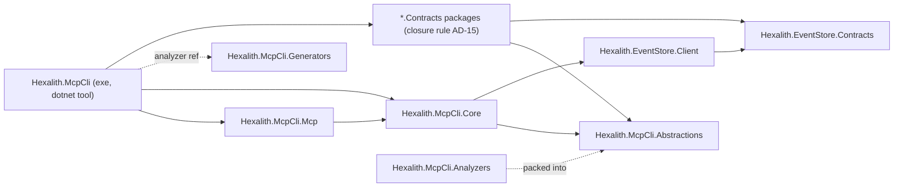
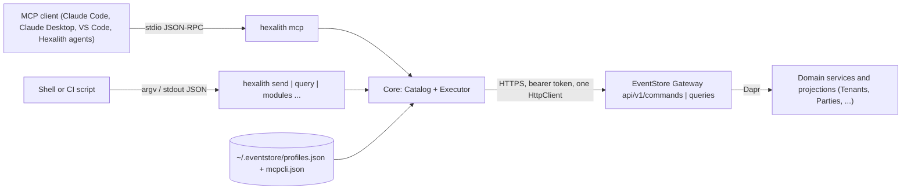
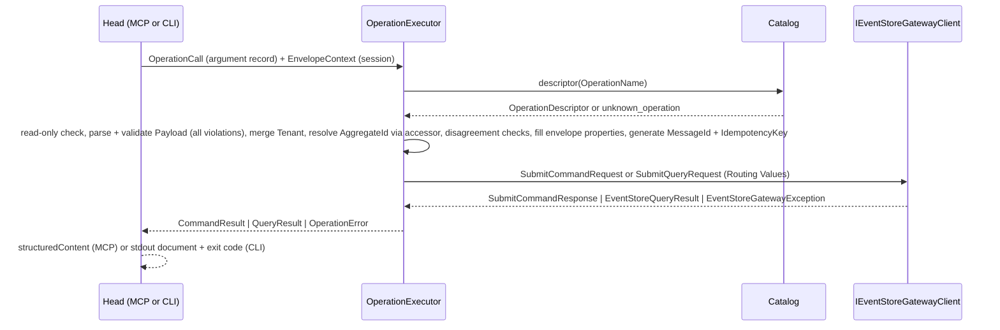

# Architecture Spine — Hexalith.McpCli

## Design Paradigm

**Hexagonal.** One core that knows Contracts types, the Catalog, validation, the Envelope, and the gateway port. Two adapters (the MCP Server head and the CLI head) that translate their protocol into the core's call model and back, and nothing else. The gateway client, the settings sources, and id generation are ports.

| Hexagon layer | Project | Namespace root |
| --- | --- | --- |
| Contract the Modules see | `Hexalith.McpCli.Abstractions` (the Decoration Package) | `Hexalith.McpCli.Abstractions` |
| Core (domain of this tool) | `Hexalith.McpCli.Core` | `Hexalith.McpCli.Core.Catalog`, `.Schema`, `.Execution`, `.Settings`, `.Serialization` |
| Adapter, MCP | `Hexalith.McpCli.Mcp` | `Hexalith.McpCli.Mcp` |
| Adapter, CLI + composition root | `Hexalith.McpCli` (the tool executable) | `Hexalith.McpCli.Cli`, `Hexalith.McpCli.Hosting` |
| Build-time discovery | `Hexalith.McpCli.Generators` | `Hexalith.McpCli.Generators` |
| Author-time guard | `Hexalith.McpCli.Analyzers` | `Hexalith.McpCli.Analyzers` |

## Invariants & Rules

### AD-1 — Heads are translators; the core decides

- **Binds:** all
- **Prevents:** a head validating a Payload, filling an Envelope, enforcing Read-only Mode, resolving settings, or reflecting over a Contracts type on its own, so that the two Heads disagree (SM-4).
- **Rule:** `Hexalith.McpCli.Core` references no MCP, System.CommandLine, or ASP.NET package. A head may only: bind its input to the Core argument records (AD-5), call `ICatalog` or `IOperationExecutor`, and render the returned records. A head reads `ResolvedSettings` from DI and never calls the resolver, the environment, or the Profile store. Every rule in FR-13 to FR-19 is implemented once, in Core.

### AD-2 — Dependency direction

- **Binds:** all projects
- **Prevents:** Contracts references leaking into a library package; a second composition root; heads sharing an assembly with the core.
- **Rule:** dependencies flow only as drawn. `Hexalith.McpCli` (exe) is the only project that references `*.Contracts` packages. `Hexalith.McpCli.Abstractions` has zero package references.



### AD-3 — The Catalog is the only view of Contracts types

- **Binds:** Core, both heads, FR-5 to FR-8, FR-19
- **Prevents:** the executor or a head re-reflecting a type and disagreeing with what `describe_operation` showed; two Catalogs in one test; `config` dying on an empty Catalog.
- **Rule:** `CatalogBuilder.Build(IReadOnlyList<Assembly>)` is the only entry point; the composition root passes the generated manifest (AD-4), unit tests pass `Sample.Contracts`. It freezes an immutable model: `ModuleDescriptor(Name, Description, IdentifierKind, Operations)` and `OperationDescriptor(Name, Kind, Description, Example, Schema, Routing, AggregateIdAccessor, EnvelopeFilledProperties)` plus `IReadOnlyList<CatalogDiagnostic>`. `System.Reflection`, the Decoration Attributes, and the contract interfaces are used only inside `Hexalith.McpCli.Core.Catalog`. The Catalog is built lazily by the first verb that needs it; `config`, `--version`, and `mcp --transport http` never touch it; an empty Catalog is a startup failure (exit 2, `catalog_empty`) only for discovery verbs, `send`, `query`, and `mcp`. `ICatalog.Describe(name)` computes `Submittable` and `Reason` from the descriptor and `ResolvedSettings.ReadOnly`; the descriptor itself carries no Read-only state.

### AD-4 — Assembly manifest is generated, not listed

- **Binds:** `Hexalith.McpCli`, `Hexalith.McpCli.Generators`, FR-5, FR-20
- **Prevents:** a hand-maintained assembly list, a folder scan, or a marker-only Contracts assembly (Folders today) missing from `list_modules`.
- **Rule:** `Hexalith.McpCli.Generators` (Roslyn incremental generator, `netstandard2.0`, `IsRoslynComponent`, `EnforceExtendedAnalyzerRules`, consumed by the exe as `ProjectReference OutputItemType="Analyzer" ReferenceOutputAssembly="false"`, never packed) walks `compilation.SourceModule.ReferencedAssemblySymbols`, keeps assemblies carrying the marker whose full metadata name equals the constant `Hexalith.McpCli.Abstractions.HexalithModuleAttribute`, and emits `ModuleAssemblyManifest.AssemblyNames` as full assembly names, ordinally sorted. The composition root loads each with `Assembly.Load(new AssemblyName(...))`; the tool ships untrimmed (AD-17), so every referenced package assembly is present. A marked assembly with zero decorated types is listed and appears in `list_modules` with zero Operations and a `no_operations` diagnostic. Same recipe as `Hexalith.EventStore.RestApi.Generators`.

### AD-5 — One call model, one document set, equal across heads

- **Binds:** Core, both heads, FR-9, FR-11, FR-12, FR-14, SM-4
- **Prevents:** two result dialects; a CLI error shape that differs from the MCP one; a document that cannot be `structuredContent`.
- **Rule:** Core owns the argument records `ListOperationsArguments(Module, Kind?)`, `DescribeOperationArguments(Operation)`, `SendCommandArguments(Operation, Payload, Tenant?, AggregateId?, CorrelationId?, IdempotencyKey?, Extensions?)`, `RunQueryArguments(Operation, Payload, Tenant?, AggregateId?, CorrelationId?, EntityId?, PageSize?, Offset?, Cursor?, Extensions?)`, and the result records `ListModulesResult(Modules, Diagnostics)`, `ListOperationsResult(Module, Operations)`, `DescribeOperationResult(Name, Kind, Description, Schema, Example, EnvelopeArguments, Submittable, Reason?)`, `CommandResult(MessageId, IdempotencyKey, CorrelationId, ResultPayload?)`, `QueryResult(CorrelationId?, Document?, Paging?)` with `Paging(PageSize, Offset, NextCursor, TotalCount, HasMore)`, and `OperationError(Code, OperationName?, Violations?, Suggestions?, Gateway?)`. `Payload` is accepted as text and parsed in Core with `McpCliJson.Payload`; text that is not JSON is one violation at `/`. Every document a head emits is one of these records serialized as a JSON object, never a top-level array; on failure both heads emit `{ "error": <OperationError> }` and nothing else. The MCP input schemas derive from the argument records; the CLI binds flags to the same records; a test asserts every argument-record property has a CLI option whose kebab-case name equals the property name. SM-4 equality is `JsonElement.DeepEquals` after each head's document is re-serialized with `McpCliJson.Result`.

### AD-6 — Two serializer options, both owned by Core

- **Binds:** Core, both heads, FR-5, FR-7, FR-15, FR-16
- **Prevents:** a camelCase Payload binding to nulls in a Module's case-sensitive validator; result documents differing across heads.
- **Rule:** `McpCliJson.Payload` — `PropertyNamingPolicy = null` (CLR property names verbatim, as EventStore's own writers do), `JsonStringEnumConverter`, nulls omitted, `UnmappedMemberHandling = Disallow`. Used for Schema derivation, Payload parsing and validation, the aggregate-identifier accessor, and the Envelope `Payload` element. `McpCliJson.Result` — `JsonSerializerDefaults.Web`, camelCase, indented, `JsonStringEnumConverter(CamelCase)`. Used for every document a head emits, for the MCP tools' `SerializerOptions`, and for their input and output schemas. No other `JsonSerializerOptions` is constructed in the solution.

### AD-7 — Schema derivation and validation

- **Binds:** Core, FR-4, FR-7, FR-15
- **Prevents:** two schema generators producing different `describe_operation` output; a validator that stops at the first violation.
- **Rule:** the Schema is `JsonSchemaExporter.GetJsonSchemaAsNode(McpCliJson.Payload, type)` with one `TransformSchemaNode` in `Hexalith.McpCli.Core.Schema` that adds `description` from `[Description]`, sets `readOnly: true` and removes from `required` each envelope-filled property (AD-9), types identifiers per AD-8, removes get-only members that have neither a setter nor a constructor parameter (such as `ICommandContract.AggregateId`), and sets `additionalProperties: false`. `EnvelopeFilledProperties` is exactly the set named by `tenantProperty`, `correlationProperty`, and `idempotencyKeyProperty`; there is no name-based inference, so a `TenantId` not named by `tenantProperty` is ordinary Payload. Validation is `JsonSchema.Net` with `OutputFormat.List`; each violation reports `InstanceLocation` (a JSON Pointer) as its path. The Schema is derived once per Operation at Catalog build and stored on the descriptor.

### AD-8 — Identifiers are marked, never guessed

- **Binds:** Abstractions, Core, FR-7, FR-15, FR-16. Amends PRD FR-7 and §3 (see PRD Amendments).
- **Prevents:** a non-ULID identifier such as the Tenants tenant id `system` failing its own Schema; the sample fixture and real Modules enforcing different kinds for the same value.
- **Rule:** the Module marker declares `IdentifierKind` (`Ulid` or `String`). A property carrying `[HexalithIdentifier]`, or named by `aggregateIdProperty`, gets Schema `{ type: string }` plus the ULID `pattern` when the Module's kind is `Ulid`; its CLR type must serialize as a JSON string under `McpCliJson.Payload` (a converter-backed value object qualifies; otherwise `invalid_identifier_type` excludes the Operation). A property whose CLR type is `Ulid` gets the pattern regardless. An unmarked property whose name ends in `Id` is a plain string and a `describe --lint` warning `unmarked_identifier`. The executor validates the explicit `aggregateId` argument and the accessor value (AD-19) with one rule keyed on the Module's kind: `Ulid.TryParse` for `Ulid`, non-empty for `String`. `tenant` is a non-empty string, never ULID-validated. Generated message identifiers and idempotency keys, and caller-supplied idempotency keys and correlation identifiers, are always ULIDs.

### AD-9 — The executor fills the Envelope [ADOPTED]

- **Binds:** Core, FR-15 to FR-17, FR-19
- **Prevents:** a head or a caller supplying a message identifier; a silently overwritten disagreement; retries anywhere.
- **Rule:** `IOperationExecutor.ExecuteAsync(OperationCall, EnvelopeContext, CancellationToken)` runs, in order: resolve descriptor (else `unknown_operation` with up to three `Suggestions`); refuse `write` under Read-only Mode (`read_only`); parse and validate the Payload (AD-7, all violations); resolve `Tenant = Arguments.Tenant ?? Context.Tenant` (a Command with none is `validation_failed` at `/tenant`); resolve the aggregate identifier (AD-19); check disagreements — a Payload value under `tenantProperty` that differs from the resolved Tenant, or an explicit `aggregateId` that differs from the accessor value, is `validation_failed` at that property's pointer; rebuild the Payload as a `JsonObject`, overwrite each envelope-filled property from the Envelope, and submit the rebuilt element; generate `MessageId` and `IdempotencyKey` as ULIDs unless supplied; build `SubmitCommandRequest` or `SubmitQueryRequest` from the descriptor's Routing Values; call `IEventStoreGatewayClient` exactly once; map `SubmitCommandResponse`, `EventStoreQueryResult` plus `Metadata.Paging`, or `EventStoreGatewayException` (status, reason code, detail, retryable, retry-after, client action, correlation identifier) to AD-5 records. For a Query, `CorrelationId` and `Extensions` travel in `SubmitQueryRequest.AdditionalProperties` as `correlationId` and `extensions` [ASSUMPTION: the Gateway reads both; EventStore owner confirms before FR-16 is implemented]. The Envelope carries Routing Values, never the Operation Name. Any exception escaping the pipeline becomes `internal_error`.

### AD-10 — Transport seam

- **Binds:** Core, `Hexalith.McpCli.Hosting`, the HTTP release
- **Prevents:** the HTTP release touching Core; tokens or headers reaching the executor; the same handler registered twice.
- **Rule:** `EnvelopeContext` carries session values only: `Tenant` from `ResolvedSettings.Tenant` in v1, `UserId` from the HTTP release. Per-call values live in the argument records; the executor alone merges them (AD-9). `AddMcpCliCore(IServiceCollection, ResolvedSettings, Action<IHttpClientBuilder> configureGateway)` calls `AddEventStoreGatewayClient(o => o.BaseAddress = settings.Url)` exactly once and hands the builder to `configureGateway`; only `Hexalith.McpCli.Hosting` adds the auth `DelegatingHandler` inside that callback: v1 `StaticBearerTokenHandler`, next release a forwarding handler in the `Hexalith.Parties.Mcp` pattern. `ResolvedSettings.Token` is never read in Core; `Core.Tests` asserts that `AddMcpCliCore` with a no-op callback registers no `DelegatingHandler`.

### AD-11 — One composition root

- **Binds:** `Hexalith.McpCli`, `Hexalith.McpCli.Mcp`, Core, FR-13, FR-17, FR-19
- **Prevents:** the admin-CLI no-container style in one head and a Host in the other; two gateway client registrations; a second settings resolver.
- **Rule:** every verb, including `mcp`, runs inside one `Host.CreateApplicationBuilder` container built by `Hexalith.McpCli.Hosting`. `SettingsResolver` runs exactly once per process, after System.CommandLine has parsed the invoked verb's global options and before the container is built; `ResolvedSettings` is registered as a singleton. Core exposes `AddMcpCliCore` (catalog, schema, executor, gateway client, ULID generation, clock); the MCP project exposes `AddMcpCliMcpServer()`; CLI verbs resolve services from that container. A test asserts exactly one `HttpClient` registration, the gateway one (FR-17).

### AD-12 — MCP head shape

- **Binds:** `Hexalith.McpCli.Mcp`, FR-9 to FR-11, FR-19, NFR-2
- **Prevents:** static `[McpServerToolType]` classes that cannot honor Read-only Mode; unstructured string results; undefined error carriage; a changing tool list.
- **Rule:** the five Generic Tools are built once with `McpServerTool.Create(delegate, McpServerToolCreateOptions { SerializerOptions = McpCliJson.Result, UseStructuredContent = true, OutputSchema })`; each `OutputSchema` is `type: object`, `additionalProperties: false`, the success record's properties plus an optional `error: OperationError`. Annotations: `ReadOnly = true` for the four read tools; `ReadOnly = false, Idempotent = false, Destructive = true` for `send_command`. A tool returns the Core record itself; on failure it returns `IsError = true` with `{ "error": ... }` as `structuredContent` and the same JSON as `Content[0].Text`; it never throws past the tool boundary. A custom list-tools handler returns full `Tool` records (name, description, `inputSchema`, `outputSchema`, annotations) in a fixed order, minus `send_command` under Read-only Mode; because settings resolve once per process (AD-11), the list never varies per connection. Tool descriptions carry the three labeled parts of FR-9 and the five definitions total under 8,000 characters (a test counts). The server is `WithStdioServerTransport()`; logging is `ClearProviders()` plus console with `LogToStandardErrorThreshold = Trace`.

### AD-13 — Settings resolution

- **Binds:** Core `.Settings`, `Hexalith.McpCli.Hosting`, FR-13, FR-18, FR-19
- **Prevents:** each head resolving `--url`, `--tenant`, or `--read-only` in a different order; `hexalith mcp --read-only` not working.
- **Rule:** every verb, `mcp` included, accepts the global options `--url --token --tenant --profile --format --output --read-only --strict`; `mcp` adds `--transport stdio|http`. `SettingsResolver` produces one `ResolvedSettings(Url, Token, Tenant?, Format, Output?, ReadOnly, Strict, Profile, Sources)` from, in precedence: flag, environment variable (`EVENTSTORE_URL`, `EVENTSTORE_TOKEN`, `EVENTSTORE_TENANT`, `EVENTSTORE_FORMAT`, `EVENTSTORE_READ_ONLY`, `EVENTSTORE_PROFILE`, `EVENTSTORE_STRICT`), Profile, default. Per-call arguments (`tenant`, and the rest of AD-5) sit above all of these and are merged by the executor. Defaults: `Url = http://localhost:8080` [ASSUMPTION: EventStore host launch profile; Aspire users set a Profile], `Format = json`, no Tenant, `ReadOnly = false`, `Strict = false`. An unresolved `Url` is `configuration_missing` naming the sources.

### AD-14 — Profile files

- **Binds:** Core `.Settings`, `config` verbs, FR-18
- **Prevents:** this tool corrupting `~/.eventstore/profiles.json` or being corrupted by the admin CLI's full rewrite.
- **Rule:** `profiles.json` is read and written with the admin CLI's exact schema (`version: 1`, `activeProfile`, `profiles.<name>.url|token|format`), file mode 600 and directory 700 on non-Windows, profile names matching `^[a-zA-Z0-9_-]{1,64}$` and excluding, case-insensitively, `version`, `activeProfile`, `profiles`, `url`, `token`, `format`; this tool adds no field to it. Every tool-specific setting lives in `~/.eventstore/mcpcli.json` as `{ "profiles": { "<name>": { "tenant": "..." } } }`; `config profile remove` deletes the entry of the same name; an entry with no matching profile is ignored and reported by `config current` as `orphaned_tenant`. A round-trip test against a fixture written by the admin CLI guards the shared file.

### AD-15 — Dependency policy

- **Binds:** all projects, PRD §4, FR-20, NFR-6, SM-C3. Amends PRD FR-20 (see PRD Amendments).
- **Prevents:** coverage gained by referencing a Module's server or client; a Contracts package that drags a web framework into the global tool; test conveniences eroding the policy by precedent.
- **Rule:** the exe references a `*.Contracts` package only when that package's transitive closure contains no Hexalith package other than `*.Contracts` packages and `Hexalith.EventStore.*` contract packages, and no `FrameworkReference` beyond `Microsoft.NETCore.App`; a closure test over the restored assets file enforces this in CI. v1 references `Hexalith.Tenants.Contracts` and `Hexalith.Parties.Contracts` from their first decorated release; `Hexalith.Projects.Contracts` (today: ASP.NET Core, Fluxor, FluentUI, FrontComposer.Shell) and `Hexalith.Folders.Contracts` are added when they satisfy the closure rule. Test projects may additionally reference `Hexalith.EventStore.Testing`, `Hexalith.EventStore.Testing.Integration`, `Aspire.Hosting.Testing`, and the Aspire composition packages `Hexalith.EventStore.Aspire` and `Hexalith.<Module>.Aspire`, which carry no server code and locate a Module's server source under `references/` at run time; never a Module aggregate, projection, handler, client, or server package. `tests/Hexalith.McpCli.Sample.Contracts` is the only synthetic Module and is never referenced by `src/`.

### AD-16 — Integration harness

- **Binds:** `tests/`, CI, NFR-7, SM-4, FR-20
- **Prevents:** tests that only assert status codes; the two heads tested in-process against different Catalogs or different topologies.
- **Rule:** `tests/Hexalith.McpCli.AppHost` (`Aspire.AppHost.Sdk/13.5.4`) composes the EventStore platform through `Hexalith.EventStore.Aspire` and the domain services of every Module v1 must cover end to end, Tenants and Parties, through their `*.Aspire` packages; those servers run from the `references/` submodule checkouts and CI checks out top-level submodules and builds them before the Aspire tier. `tests/Hexalith.McpCli.IntegrationTests` subclasses `AspireTopologyFixtureBase<Projects.Hexalith_McpCli_AppHost>`, drives the built `hexalith` executable out of process for both heads (the CLI as a process, the MCP Server through the ModelContextProtocol client over stdio; the tool path supplied by a `ProjectReference ReferenceOutputAssembly="false"` plus a runtime host configuration option), asserts accepted Commands and returned Query documents, and asserts AD-5 equality over every Operation in `list_operations` for both Modules, including discovery and error documents. Tests skip through the standard Dapr prerequisite check and run as the `aspire-test-project` tier of `domain-ci.yml`. Unit tests use `FakeEventStoreGatewayClient` or NSubstitute and never a network.

### AD-17 — Release, versioning, packaging

- **Binds:** repository root, CI, PRD §7
- **Prevents:** a second release pipeline; a trimmed tool whose Contracts assemblies are missing.
- **Rule:** semantic-release on `main` with tag format `v<version>`, `dotnet build Hexalith.McpCli.slnx -p:Version=<next release version>`, `tools/release-packages.json` listing exactly `Hexalith.McpCli.Abstractions` and `Hexalith.McpCli`, push to nuget.org; CI is a thin `ci.yml` calling `Hexalith/Hexalith.Builds/.github/workflows/domain-ci.yml@main`. Both packages share one version. The tool is a framework-dependent, untrimmed dotnet global tool: `PackAsTool`, `ToolCommandName = hexalith`, `CreateRidSpecificToolPackages = false`, `UseAppHost = false`, no `PublishTrimmed`, no `PublishAot`. Package version property `HexalithMcpCliVersion` is added to the Hexalith.Builds catalog.

### AD-18 — Analyzer packaging

- **Binds:** `Hexalith.McpCli.Analyzers`, `Hexalith.McpCli.Abstractions`, FR-1
- **Prevents:** the Decoration Package acquiring a package reference; a Module author needing a second reference to get the warning.
- **Rule:** the analyzer project (`netstandard2.0`, `IsRoslynComponent`, `EnforceExtendedAnalyzerRules`, `Microsoft.CodeAnalysis.CSharp` with `PrivateAssets="all"`) is packed into the Abstractions package under `analyzers/dotnet/cs`. The Abstractions package may ship before the analyzer exists.

### AD-19 — Aggregate identifier resolution

- **Binds:** Core `.Catalog`, `.Execution`, FR-2, FR-16
- **Prevents:** the Catalog and the executor deriving the aggregate identifier differently; interface-routed Commands (whose `AggregateId` is a computed getter with no Payload member) failing every call.
- **Rule:** `OperationDescriptor.AggregateIdAccessor` is a `Func<JsonElement, string?>` compiled once at Catalog build: when `aggregateIdProperty` is set, a JSON Pointer read of that member; otherwise, for an `ICommandContract` implementer, deserialization of the validated Payload into the contract type with `McpCliJson.Payload` and the interface getter; a Command with neither is excluded with `missing_routing_values`. `aggregateIdProperty` is optional for a Query [amends PRD §5.1]; a Query without it has a null accessor. The executor resolves: explicit `aggregateId` argument, else the accessor value; a Command resolving to nothing is `validation_failed`; a Query resolving to nothing sends `string.Empty` [ASSUMPTION pending PRD OQ-3].

### AD-20 — Paging is Envelope-only

- **Binds:** Core, both heads, FR-9, FR-17
- **Prevents:** paging carried both in the Payload and in the Envelope, or by different members in each head.
- **Rule:** `pageSize`, `offset`, `cursor` exist only as `RunQueryArguments` members and map to `SubmitQueryRequest.Paging`; `QueryResult.Paging` maps `Metadata.Paging`. A Query Payload member named `PageSize`, `Offset`, or `Cursor` is ordinary Payload and a `describe --lint` warning `unmarked_paging_member`; the Module decides whether to drop it (the Tenants prerequisite in PRD §8.1).

## Consistency Conventions

| Concern | Convention |
| --- | --- |
| Project and test names | `src/Hexalith.McpCli.<Part>`; `tests/Hexalith.McpCli.<Part>.Tests` one per `src` project; `tests/Hexalith.McpCli.IntegrationTests`; `tests/Hexalith.McpCli.AppHost`; `tests/Hexalith.McpCli.Sample.Contracts`. |
| Decoration Attributes | `[HexalithCommand]`, `[HexalithQuery]` (members per PRD §5.1), `[HexalithIdentifier]` on properties, assembly-level `[HexalithModule(name, description, IdentifierKind)]`. Properties described with `System.ComponentModel.Description`. Target framework `net10.0`, like sibling Contracts. |
| Operation Name | `<module>.<kebab-case type name minus Command/Query suffix>` or the attribute `name` override; identical in both heads; never the Wire Type (FR-8). Kebab-case: split before an upper-case letter that follows a lower-case letter or digit, and before the last upper-case letter of a run that precedes a lower-case letter (`TLSConfig` → `tls-config`); digits stay attached; ASCII lower-case. One `public static` helper in `Hexalith.McpCli.Abstractions`, shared by Catalog and analyzer. |
| Routing per field | contract interface value when the interface defines the field, else the attribute member; equal values ignored, differing values a `conflicting_value` warning with the interface winning (FR-2). |
| Catalog diagnostics | `CatalogDiagnostic(TypeName, Category, Severity, Message)`; error categories `missing_description`, `missing_routing_values`, `duplicate_operation_name`, `invalid_example`, `duplicate_module_name`, `invalid_identifier_type`; warning categories `conflicting_value`, `undescribed_property`, `no_operations`; written once to stderr at first Catalog build through `ILogger`; `ListModulesResult.Diagnostics` carries `{ errors, warnings }` counts; startup fails only on an empty Catalog or `--strict` with any diagnostic. |
| Lint (`describe --lint`) | `undescribed_property`, `unmarked_identifier`, `unmarked_paging_member`, `hollow_description` (description equal to the humanized type or property name, NFR-8, SM-C4); any finding exits 1. |
| Error codes | `validation_failed`, `unknown_operation`, `read_only`, `gateway_error`, `configuration_missing`, `catalog_empty`, `unsupported_transport`, `internal_error`; `OperationError.Code` is the only discriminator both heads switch on. |
| Exit codes | 0 result; 1 result plus a diagnostic for this invocation (discovery verbs with any Catalog diagnostic, `describe --lint` with a finding); 2 no result (FR-14). Only the CLI head maps codes. |
| Channels | stdout carries JSON-RPC (`mcp`) or the result document (verbs); everything else goes to stderr through source-generated `LoggerMessage` methods; `Console.WriteLine` appears only in the CLI output writer. Tokens never appear in any output; `config current` masks a token to its first four characters. |
| Determinism | Modules and Operations sorted ordinally; `tools/list` in fixed order; documents serialized with `McpCliJson.Result`; discovery output byte-identical per build across operating systems (FR-5). |
| Identifier generation | `Ulid.New()` from `ByteAether.Ulid`; one message identifier and one idempotency key per call; `Ulid.TryParse` for validation; ids travel as strings. |
| Table output | `--format table` exists only in the CLI head, hand-written over `System.Console` (no Spectre.Console); columns are declared per verb next to the verb; Core and the MCP head never format. |
| Query results | `QueryResult.Document = EventStoreQueryResult.Payload`; client type names never appear in a head document. |
| State | the Catalog is immutable after build; the executor is stateless; the only mutable state is the two profile files, written by `config` verbs only. |
| Tests | xunit.v3, Shouldly, NSubstitute from `tests/Directory.Build.props`; Verify.XunitV3 snapshots for the Catalog dump and the five tool definitions; `[Trait("Category", "Integration")]` on topology tests; `Sample.Contracts` declares two Modules, `sample-ulid` (`IdentifierKind = Ulid`) and `sample-opaque` (`IdentifierKind = String`), one `ICommandContract` command, one attribute-routed command, one converter-backed value-object identifier, and one query. |
| Code style | `Hexalith.Builds` conventions: central package management from `references/Hexalith.Builds/Props/Directory.Packages.props` with the three-path import, `TreatWarningsAsErrors`, one type per file, StyleCop header. |

## Stack

| Name | Version |
| --- | --- |
| .NET SDK (global.json, Microsoft.Testing.Platform runner) | 10.0.401 |
| C# | 14 |
| ModelContextProtocol (Core is transitive; AspNetCore reserved for the HTTP release) | 2.2.0 (MCP revision 2026-07-28) |
| System.CommandLine | 2.0.12 |
| Hexalith.EventStore.Client / .Contracts | 3.106.0 |
| Hexalith.Tenants.Contracts | first decorated release (≥ 5.7.0) |
| Hexalith.Parties.Contracts | first decorated release (≥ 1.1.1) |
| ByteAether.Ulid | 1.4.1 |
| JsonSchema.Net (new central pin) | 9.4.0 |
| Microsoft.Extensions.Hosting, .Http (exe); .Logging.Abstractions (Core) | 10.0.12 |
| Microsoft.CodeAnalysis.CSharp, .Analyzers (generator and analyzer) | 5.9.0 |
| xunit.v3 / Shouldly / NSubstitute / Verify.XunitV3 | 4.0.1 / 4.3.0 / 6.2.0 / 33.0.2 |
| Aspire.Hosting.Testing, Aspire.AppHost.Sdk | 13.5.4 |
| CommunityToolkit.Aspire.Hosting.Dapr | 13.5.1-beta (catalog pin) |
| Hexalith.EventStore.Testing, .Testing.Integration, .Aspire; Hexalith.Tenants.Aspire, Hexalith.Parties.Aspire (tests only) | 3.106.0; 5.7.0; 1.1.1 |

## Structural Seed

```text
Hexalith.McpCli.slnx
Directory.Build.props            # three-path import of references/Hexalith.Builds/Props/Directory.Packages.props
Directory.Packages.props
global.json                      # copied from references/Hexalith.Builds
tools/release-packages.json      # Hexalith.McpCli.Abstractions, Hexalith.McpCli
.releaserc.json  package.json  commitlint.config.mjs
.github/workflows/ci.yml release.yml commitlint.yml
src/
  Hexalith.McpCli.Abstractions/  # HexalithCommandAttribute, HexalithQueryAttribute, HexalithIdentifierAttribute, HexalithModuleAttribute, IdentifierKind, KebabCase
  Hexalith.McpCli.Core/
    Catalog/                     # CatalogBuilder, ModuleDescriptor, OperationDescriptor, RoutingResolver, AggregateIdAccessors, CatalogDiagnostic, ICatalog
    Schema/                      # SchemaDeriver (exporter + transform), PayloadValidator (JsonSchema.Net)
    Execution/                   # OperationExecutor, OperationCall, EnvelopeContext, argument records, result records, OperationError
    Settings/                    # SettingsResolver, ResolvedSettings, ProfileStore, McpCliSettingsStore
    Serialization/               # McpCliJson (Payload, Result)
    ServiceCollectionExtensions.cs  # AddMcpCliCore
  Hexalith.McpCli.Mcp/           # GenericTools (five McpServerTool instances), ListToolsHandler, AddMcpCliMcpServer
  Hexalith.McpCli/               # Program.cs, Hosting/ (SettingsBootstrap, StaticBearerTokenHandler, ManifestLoader), Cli/ (verbs, GlobalOptions, OutputWriter, TableFormatter), *.Contracts package refs
  Hexalith.McpCli.Generators/    # ModuleAssemblyManifestGenerator
  Hexalith.McpCli.Analyzers/     # MissingDescriptionAnalyzer (separable story)
tests/
  Directory.Build.props
  Hexalith.McpCli.Sample.Contracts/   # two synthetic Modules (see Tests convention)
  Hexalith.McpCli.Abstractions.Tests/ Core.Tests/ Mcp.Tests/ Tests/ Generators.Tests/ Analyzers.Tests/
  Hexalith.McpCli.AppHost/            # Aspire topology: EventStore platform + Tenants + Parties
  Hexalith.McpCli.IntegrationTests/   # AspireTopologyFixture, out-of-process both-heads equality tests
```

**Runtime and deployment view.** The tool is one process on a developer's or agent host's machine; no hosted infrastructure in v1.



| Environment | What runs | Who provides it |
| --- | --- | --- |
| Developer machine | `hexalith` installed with `dotnet tool install -g Hexalith.McpCli`; EventStore from a Module AppHost or the EventStore host on `localhost:8080` | developer |
| CI (ubuntu-latest, `domain-ci.yml`) | build with `-warnaserror`, unit tests, closure test, then the Aspire tier after `dapr-init` with top-level submodules checked out and built | Hexalith.Builds workflow |
| Release | `workflow_dispatch` on a green `main` SHA; semantic-release packs and pushes two packages to nuget.org | maintainers |
| Next release, hosted HTTP | `hexalith mcp --transport http` behind the forwarding handler; not designed here | deferred |

**Call pipeline** (both heads, one path):



## Capability → Architecture Map

| Capability | Lives in | Governed by |
| --- | --- | --- |
| FR-1 to FR-4 Operation Decoration | `Hexalith.McpCli.Abstractions`, `Hexalith.McpCli.Analyzers` | AD-2, AD-8, AD-18, conventions (attributes, kebab-case, lint) |
| FR-5, FR-6, FR-8 Catalog build, diagnostics, naming | `Core.Catalog`, `Hexalith.McpCli.Generators` | AD-3, AD-4, conventions (diagnostics, determinism) |
| FR-7 Schema | `Core.Schema` | AD-6, AD-7, AD-8 |
| FR-9 to FR-11 MCP Server | `Hexalith.McpCli.Mcp` | AD-1, AD-5, AD-12 |
| FR-12 to FR-14 CLI verbs, options, exit codes | `Hexalith.McpCli/Cli` | AD-1, AD-5, AD-13, conventions (exit codes, table) |
| FR-15 to FR-17, FR-19 Executor, Envelope, Read-only | `Core.Execution` | AD-5, AD-6, AD-9, AD-10, AD-19, AD-20 |
| FR-18 Profiles | `Core.Settings`, `config` verbs | AD-13, AD-14 |
| FR-20 Coverage of v1 Modules | `Hexalith.McpCli` package references | AD-2, AD-4, AD-15 |
| FR-21, FR-22 Migration plan, upstream rule | documents outside `src/` | AD-15 (policy), PRD |
| NFR-1 Startup < 500 ms | `Core.Catalog` | AD-3 (build once), AD-4 (no folder scan); benchmark test |
| NFR-2 Tool budget | `Hexalith.McpCli.Mcp` | AD-12 |
| NFR-4, NFR-5 Channels, secrets | both heads | conventions (channels), AD-10 |
| NFR-6 Portability | tool packaging | AD-15 (closure), AD-17 |
| NFR-7 Testability | `tests/` | AD-15, AD-16 |
| NFR-8 Description quality | `describe --lint`, review of the Catalog dump | conventions (lint) |
| SM-4 Heads agree | `tests/Hexalith.McpCli.IntegrationTests` | AD-5, AD-16 |

## Deferred

- **HTTP transport and authentication design** (PRD OQ-1). The seam is fixed by AD-10; issuer, token validation, header forwarding, and `EnvelopeContext.UserId` are designed before the HTTP story. `mcp --transport http` exits 2 with `unsupported_transport` until then.
- **Typed tools behind a module filter, generated per-Operation subcommands, shell completion, MCP resources and prompts, plug-in loading, event stream reading, executor retries.** Parked by the PRD; none affects the AD set because each would be a new adapter or a new port, not a change to Core.
- **Command status lookup** through `GetCommandStatusAsync`; the message identifier is returned meanwhile.
- **Query search, filters, order-by, freshness, `ifNoneMatch`.** `SubmitQueryRequest` carries them; `RunQueryArguments` gains optional members in a minor version when they are exposed.
- **Payload-level paging members** (`pageSizeProperty` and kin on the Query attribute): only if a Module keeps paging inside its Payload after the Tenants decision; AD-20 stays the default.
- **Analyzer rules beyond missing description**: the runtime lint covers `hollow_description` first.
- **Native AOT or trimming of the tool.** AD-17 ships untrimmed; revisit only if NFR-1 fails on measurement, then with `TrimmerRootAssembly` per Contracts assembly.
- **Multi-targeting the Decoration Package** to `netstandard2.0`: only if a Contracts Library that does not target `net10.0` appears.
- **Composition of Projects and Folders in the test AppHost.** Added when each satisfies AD-15 and is Gateway-ready; the fixture takes a resource list, so it is additive.
- **Table column layouts per verb.** Story-level, in the CLI head.
- **`config` verb parity details** (`profile add|remove|list`, `use`, `current`): behave as the admin CLI; exact flags copied at story time from `Hexalith.EventStore.Admin.Cli`.

## Open Questions

- **OQ-3 (PRD) Aggregate-less Queries.** AD-19 sends an empty aggregate identifier for a Query with no accessor value [ASSUMPTION]; the EventStore owner confirms before FR-16 is implemented, together with whether the Gateway reads `correlationId` and `extensions` from `SubmitQueryRequest.AdditionalProperties` (AD-9).
- **CI inputs for the Aspire tier.** Which `domain-ci.yml` inputs check out and build the `references/` sources the test AppHost composes; settled at the harness story.
- **Hexalith.Builds catalog additions.** `JsonSchema.Net 9.4.0` pin and the `HexalithMcpCliVersion` property must land upstream before the first CI restore.

## PRD Amendments

Decisions in this spine that change the PRD; the PRD is updated so epics cite one rule.

- **FR-7 and §3 (AD-8):** identifiers are typed by explicit marking and the Module's `IdentifierKind`, not by the `Id` name suffix; a value-object identifier serializes as its own declared converter dictates and the tool adds none; "Identifiers are ULIDs" narrows to generated and caller-supplied envelope identifiers.
- **FR-3 (AD-8):** the Module marker gains `IdentifierKind`.
- **§5.1 and FR-2 (AD-19):** `aggregateIdProperty` is optional for a Query; an interface-routed Command needs none because the executor reads the contract getter through the compiled accessor.
- **FR-16 (AD-19):** "read through a JSON path derived once at startup" becomes "read through an accessor compiled once at startup".
- **FR-20 (AD-15):** v1 references only Contracts packages that satisfy the closure rule; today that is Tenants and Parties; slimming `Hexalith.Projects.Contracts` becomes a Projects Gateway-ready prerequisite.
- **FR-6 and FR-14 (AD-3):** an empty Catalog fails only the verbs that need it; `config` and `--version` always run.
- **FR-13 (AD-13):** adds `EVENTSTORE_STRICT`.
- **Resolved here:** OQ-2 flat layout; OQ-4 analyzer is a separate project packed into the Decoration Package; OQ-7 command `hexalith`, packages `Hexalith.McpCli` and `Hexalith.McpCli.Abstractions`.
